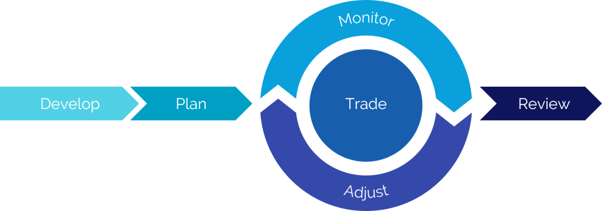

## About InvestOps

InvestOps is shorthand for investment operations. It describes the process investors follow in deciding when and how to make their investments.

### InvestOps stages

InvestOps breaks down investing into a series of stages. These stages provide a framework for planning and managing decisions based on the unique considerations for each phase of an investment's lifecycle. By defining clear boundaries between each stage, an investor can more easily focus on the goals and deliverables for the task at hand.

#### Developing a view

The first stage of InvestOps focuses on defining the investor's view. The purpose of this stage is to build an actionable opinion informed by research. There are so many sources of research and investment ideas out there, so this stage requires a thoughtful approach to sifting through all of the data in order to produce a specific view.

#### Planning a trade

The second stage of InvestOps involves building a trade strategy that expresses the view produced in the previous stage. While many investors simultaneously research a view and a trade at the same time, it is recommended that these stages be clearly distinct in order to avoid the trade potential skewing the opinion formed in the view. This stage produces a trade plan, which should include details about entry, adjustment, and exit strategies.

#### Trading the plan

The trading stage may be visited multiple times over the course of an investment. The first visit follows the entry plan and enters the market using the trade plan's parameters. Later on, it is usually necessary to return to this stage in order to adjust or close the investment. This stage produces a new, updated, or fully exited market position.

#### Monitoring the investment

Most of the calendar time spent in an investment occurs in the monitoring stage. This stage is responsible for tracking positions, market conditions, the passage of time, and any other factors relevant to the future of the investment. When there is a development significant enough to warrant a change in the investment, it is raised to the adjustment stage.

#### Adjusting the investment

When the monitoring stage detects a condition that requires the investment to be updated, the adjustment stage is responsible for planning those changes. Sometimes the adjustment will be to close the investment entirely. Other times it will be to replace specific positions, such as rolling a covered call. This purpose of this stage is to produce a trade adjustment plan consistent with the investor's current view, which are then passed to the trading stage.

#### Reviewing the results

After an investment has exited, investors often like to look back on past performance in order to improve their craft in the review stage. This is where the investor takes stock of not only the investment's performance, but also of their own process and decision making. This stage produces a postmortem review of the investment that the investor can use to learn from and improve. 

### In-depth training

Check out Quantcha's [official training for InvestOps](https://docs.quantcha.com/courses/getting-started-with-investops/).

### Using or contributing to InvestOps

InvestOps is maintained as an [open source project on GitHub](https://github.com/InvestOps/InvestOps). Feel free to use and contribute as you wish.